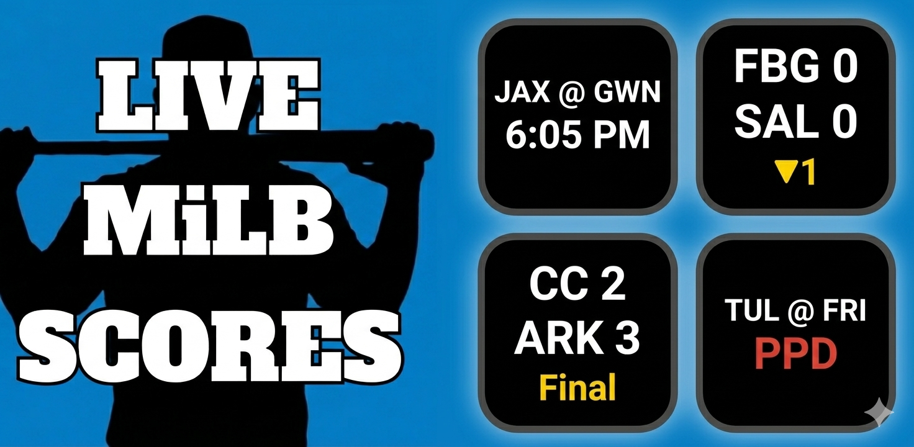
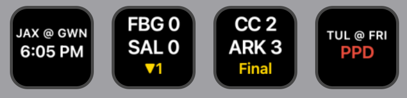

# Live MiLB Scores — Stream Deck Plugin




A Stream Deck plugin that shows live Minor League Baseball scores directly on your buttons. Each button tracks one team and updates automatically every 30 seconds.

 

---

## Features

- **Live scores** — shows away score, home score, and current inning while a game is in progress
- **Pre-game** — shows the matchup (e.g. `CLT @ JAX`) and scheduled start time
- **Final scores** — shows the final score with a "Final" label
- **Score-change flash** — when your team scores, the button flashes in that team's MLB parent organization's color
- **Browser shortcut** — press any button to open that game on MiLB Gameday or MiLB.tv; switches to Gameday automatically 30 minutes after the final out
- **Doubleheader support** — automatically shows Game 1, then switches to Game 2 when it ends; G1/G2 label keeps you oriented
- **Doubleheader toggle** — double-click a doubleheader button to peek at the other game; auto-reverts after 15 seconds
- **No-flicker updates** — buttons only redraw when the display actually changes
- **Multi-button support** — add as many team buttons as you want, each refreshes independently
- **Always up-to-date team list** — teams are loaded live from the MiLB API, so affiliate changes between seasons are reflected automatically

---

## Recent Updates

**v1.0.12.0**
- Out indicators: two dots appear to the left of the inning — gray for unrecorded outs, red for recorded outs (inspired by classic out-of-town scoreboards)

**v1.0.9.0**
- After a game ends, pressing a button set to MiLB.tv now opens Gameday instead — the MiLB.tv link stays active for 30 minutes post-game to cover any post-game coverage, then switches automatically
- If the plugin loads and the game is already final, pressing the button goes straight to Gameday

**v1.0.8.0**
- Double-click a doubleheader button to peek at the other game — when Game 1 is active, see Game 2's start time; when Game 2 is active, see Game 1's final score
- Double-click again to snap back to the active game, or wait 15 seconds to auto-revert
- Single-clicking while viewing the other game opens that game's Gameday page
- Score changes and end-of-game fireworks always return the button to the active game view

**v1.0.7.0**
- Doubleheader support: automatically shows Game 1 until it ends, then switches to Game 2
- G1/G2 label appears next to the inning indicator, start time, or final/PPD/SUSP status so you always know which game you're watching
- Game 2 start time TBD handled gracefully — shows "TBD" instead of a blank or wrong time

**v1.0.6.0**
- Updated Oakland Athletics to Athletics (ATH) to reflect team's relocation to Sacramento

**v1.0.5.0**
- Updated action and category icons to white on transparent background
- Added plugin category for Stream Deck action picker grouping

**v1.0.4.0**
- Schedule now holds on the current day's games until 2 AM local time, so late-running games stay on the button until they finish

**v1.0.3.0**
- PPD and SUSP now display in red — signals the game won't happen today
- Pre-game rain delay displays DELAY in blue
- Mid-game rain delay keeps the current score visible with DELAY in blue where the inning indicator normally sits

*Note: v1.0.2 was an internal build — all changes are included here.*

**v1.0.2.0**
- Inning indicator and "Final" label now display in yellow
- End-of-game fireworks animation with winning team's name and colors

**v1.0.1.0**
- Added custom icons

---

## Requirements

- [Elgato Stream Deck](https://www.elgato.com/stream-deck) hardware
- [Stream Deck software](https://www.elgato.com/downloads) version 6.0 or later (Mac or Windows)
- No account required for scores — the plugin uses MLB/MiLB's free public stats API

---

## Installation

1. Download the latest **`Live MiLB Scores.streamDeckPlugin`** from the [Releases](../../releases) page
2. Double-click the file — Stream Deck will install it automatically
3. The plugin will appear in the Stream Deck action picker under **Live MiLB Scores**

---

## Setup

1. Drag the **Live MiLB Scores** action onto any button
2. In the settings panel on the right, pick how you want to browse for your team:

**Browse by League** — drill down by level, then league, then team:

| Level | Leagues |
|-------|---------|
| Triple-A | International League, Pacific Coast League |
| Double-A | Eastern League, Southern League, Texas League |
| High-A | Midwest League, Northwest League, South Atlantic League |
| Single-A | California League, Carolina League, Florida State League |


**Browse by MLB Organization** — pick an MLB parent club to see all of their affiliates grouped by level.


3. Choose what happens when you press the button:
   - **MiLB Gameday (free)** — opens the game's Gameday page on MiLB.com
   - **MiLB.tv (subscription)** — opens the live stream page on MiLB.com

That's it. The button will load your team's game within a few seconds and refresh every 30 seconds from there.

---

## What the Button Shows



**Before the game:**
```
CLT @ JAX
 7:05 PM
```

**Live game:**
```
CLT 3
JAX 1
 ▲5
```

**Final score:**
```
CLT 3
JAX 1
Final
```

**Off day:**
```
 CLT
No Game
```

---

## Supported Teams

All four levels of affiliated Minor League Baseball are supported — 120 teams across 12 leagues. The team list is fetched live from the MiLB API each time you open the settings panel, so it stays accurate as affiliates change from season to season.

| Level | Leagues |
|-------|---------|
| Triple-A | International League · Pacific Coast League |
| Double-A | Eastern League · Southern League · Texas League |
| High-A | Midwest League · Northwest League · South Atlantic League |
| Single-A | California League · Carolina League · Florida State League |

---

## How It Works

The plugin polls [MLB's free public Stats API](https://statsapi.mlb.com) once every 30 seconds per button using sport IDs for all four MiLB levels (Triple-A through Single-A). No API key or account is required. The plugin is fully self-contained — it uses only Node.js built-in modules and requires no external dependencies.

---

## Uninstalling

Open Stream Deck → Preferences → Plugins, select **Live MiLB Scores**, and click the **−** button.

---

## Contributing

Bug reports and feature requests are welcome — open an [Issue](../../issues) to get started.

---

## Disclaimer

This plugin is not affiliated with, endorsed by, or sponsored by Major League Baseball or MLB Advanced Media, L.P. All data is sourced from the MLB Stats API and is subject to MLBAM's terms of use. This plugin is intended for individual, personal, non-commercial use only.

---

## Credits

Created by **T.J. Lauerman aka ThatSportsGamer**

Created with Claude Cowork by Anthropic

Data provided by the [MLB Stats API](https://statsapi.mlb.com)
