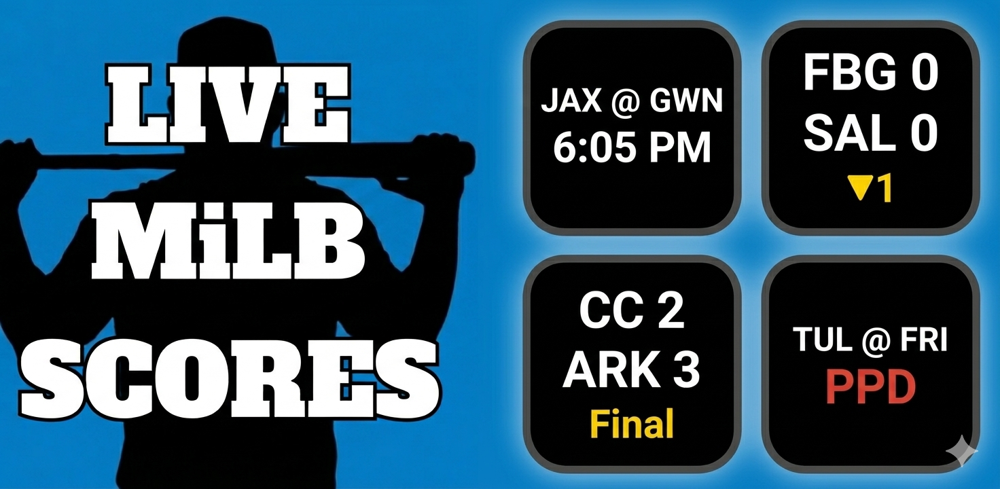
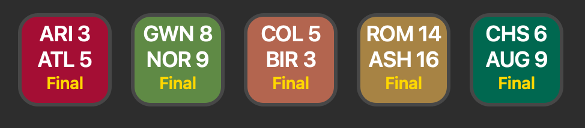
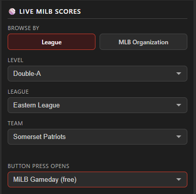
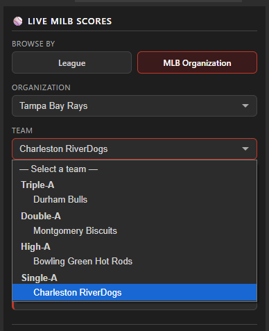
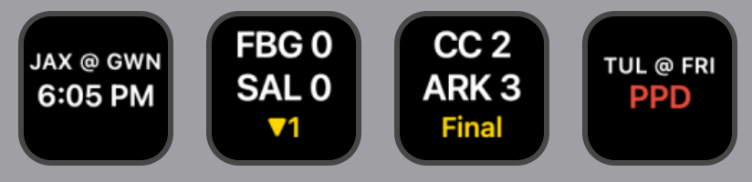

# Live MiLB Scores — Stream Deck Plugin



A Stream Deck plugin that shows live Minor League Baseball scores directly on your keys. Each key tracks one team and updates automatically every 30 seconds.

 

---

## Features

- **Live scores** — shows away score, home score, and current inning while a game is in progress
- **Pre-game** — shows the matchup (e.g. `CLT @ JAX`) and scheduled start time
- **Final scores** — shows the final score with a "Final" label
- **Score-change flash** — when your team scores, the key flashes in that team's MLB parent organization's color
- **Browser shortcut** — press any key to open that game on MiLB Gameday, MiLB.tv, or a custom link of your choice (e.g. your regional sports network); switches to Gameday automatically 30 minutes after the final out
- **Doubleheader support** — automatically shows Game 1, then switches to Game 2 when it ends; G1/G2 label keeps you oriented
- **Doubleheader toggle** — double-click a doubleheader key to peek at the other game; auto-reverts after 15 seconds
- **No-flicker updates** — keys only redraw when the display actually changes
- **Multi-key support** — add as many team keys as you want, each refreshes independently
- **Always up-to-date team list** — teams are loaded live from the MiLB API, so affiliate changes between seasons are reflected automatically
- **Search** — type a team, city, or mascot name to jump straight to it instead of drilling through League/Organization dropdowns
- **Next game on off days** — instead of a dead-end "No Game", the key shows your team's next scheduled matchup, date, and time
- **Custom key background color** — pick your own background color and opacity instead of the default black


*The Braves (left, Live MLB Scores) alongside four of their affiliates (Live MiLB Scores), each with its own custom key background color.*

---

## Recent Updates

**v1.0.30.0**
- Added a "Custom Link" option to Key Press Opens — enter any URL (e.g. your regional sports network's live-game page) and the key opens Gameday until the game actually starts, then switches to your link. Falls back to Gameday if the field is left blank. The URL field also auto-adds `https://` if you leave the scheme off

**v1.0.29.0**
- Added a custom key background color option (matching Live NFL Scores and Live CFB Scores) — pick a color and opacity in the settings panel instead of the default black

**v1.0.28.0**
- Fixed: pressing a key set to MiLB.tv during the Warmup state (right before first pitch, including right after a rain delay clears) fell back to Gameday instead of opening the stream — MiLB.tv already carries Warmup as pre-game coverage, so it now opens directly

**v1.0.27.0**
- Coming out of a rain delay, the key now shows `WARMUP` alongside the original scheduled time instead of just re-displaying that now-stale clock as if nothing happened

**v1.0.26.0**
- Added a search box to the settings panel (ported from Live CFB Scores) — type a team, city, or mascot name for autocomplete instead of drilling through the League/Organization dropdowns. Picking a result still syncs the dropdowns underneath, so both paths stay in sync
- Search results show each team's level (AAA/AA/A+/A) as a small badge on the right, matching the layout used in Live NHL Scores' search box
- That badge also shows the MLB parent org's abbreviation (e.g. "AAA · ATL")
- Search now also matches on the MLB parent org's name — searching "Braves" surfaces every Atlanta affiliate across all four levels, not just teams whose own name contains "Braves"

**v1.0.25.0**
- Fixed: a mid-game rain delay could link to `/gameday/away-vs-home/...` (literal placeholder text) instead of the real team names — the team slugs were missing from that specific state's data

**v1.0.24.0**
- Fixed: the postponed/suspended schedule-page fallback (added in v1.0.23.0) was linking to the wrong page — it used each team's literal home city (e.g. "Bridgewater," "Wappingers Falls") instead of the brand name MiLB.com actually uses in its URLs ("Somerset," "Hudson Valley")

**v1.0.23.0**
- Fixed: a postponed or suspended game whose gamePk gets reassigned to a new makeup date could send you into an infinite redirect loop on MiLB.com's Gameday page. Postponed/suspended keys now link to your tracked team's schedule page instead, which always resolves

**v1.0.22.0**
- Fixed: a pre-game weather delay (e.g. "Delayed Start") could be misread as a mid-game delay because MLB's linescore data pre-populates a "Top 1" shell before first pitch — this in turn caused the previous fix's MiLB.tv fallback check to think the game had started and open the stream early. Now checks the game's actual live/preview status instead

**v1.0.21.0**
- Fixed: pressing a key set to MiLB.tv for a game delayed past its scheduled start time no longer opens the stream early — the plugin now checks the game's actual status instead of the clock, so a rain delay correctly falls back to Gameday until the game actually begins

**v1.0.20.0**
- Fixed: Gameday links now use the correct calendar date for evening games — West Coast/Mountain affiliates whose game time crosses into the next UTC day were getting a link one day ahead of the real game

**v1.0.19.0**
- Fixed: Gameday links now use the correct URL suffix for the game's actual state — pressing a key for a preview, delayed, postponed, or "Next Game" matchup no longer sends you to a blank `/live` page (also fixed for the mid-game rain-delay state, which previously fell through to `/preview` instead of `/live`)

**v1.0.18.0**
- Trimmed the "Next Game" date to just month/day (e.g. `7/25`) instead of including the day of the week — the line was running out of room on the key

**v1.0.17.0**
- Fixed: keys could incorrectly show "No Game" (or, as of the previous release, the wrong "Next Game" info) during the 15-20 minute pre-game warmup window due to a bug in how the start time was read — the warmup countdown now displays correctly right up until first pitch
- Fixed: postponed, suspended, and pre-game delayed games now carry full team info so the Gameday link opens the correct game instead of a generic fallback URL

**v1.0.16.0**
- On off days, the key now shows your team's next scheduled game (matchup, date, and time) instead of a dead-end "No Game"

**v1.0.15.0**
- Fixed: the inning/out indicator row now stays centered when a G1 or G2 label is shown during doubleheaders

**v1.0.14.0**
- Pre-game delays now show the updated start time alongside the DELAY indicator — if the first pitch gets pushed back, the key reflects the new time within 30 seconds

**v1.0.13.0**
- Fixed: key no longer switches to "Top 1" during pre-game warmups before first pitch — the matchup and start time stay visible until the game actually begins

**v1.0.12.0**
- Out indicators: two dots appear to the left of the inning — gray for unrecorded outs, red for recorded outs (inspired by classic out-of-town scoreboards)

**v1.0.9.0**
- After a game ends, pressing a key set to MiLB.tv now opens Gameday instead — the MiLB.tv link stays active for 30 minutes post-game to cover any post-game coverage, then switches automatically
- If the plugin loads and the game is already final, pressing the key goes straight to Gameday

**v1.0.8.0**
- Double-click a doubleheader key to peek at the other game — when Game 1 is active, see Game 2's start time; when Game 2 is active, see Game 1's final score
- Double-click again to snap back to the active game, or wait 15 seconds to auto-revert
- Single-clicking while viewing the other game opens that game's Gameday page
- Score changes and end-of-game fireworks always return the key to the active game view

**v1.0.7.0**
- Doubleheader support: automatically shows Game 1 until it ends, then switches to Game 2
- G1/G2 label appears next to the inning indicator, start time, or final/PPD/SUSP status so you always know which game you're watching
- Game 2 start time TBD handled gracefully — shows "TBD" instead of a blank or wrong time

**v1.0.6.0**
- Updated Oakland Athletics to Athletics (ATH) to reflect team's relocation to Sacramento

**v1.0.5.0**
- Updated action and category icons to white on transparent background
- Added plugin category for Stream Deck action picker grouping

**v1.0.4.0**
- Schedule now holds on the current day's games until 2 AM local time, so late-running games stay on the key until they finish

**v1.0.3.0**
- PPD and SUSP now display in red — signals the game won't happen today
- Pre-game rain delay displays DELAY in blue
- Mid-game rain delay keeps the current score visible with DELAY in blue where the inning indicator normally sits

*Note: v1.0.2 was an internal build — all changes are included here.*

**v1.0.2.0**
- Inning indicator and "Final" label now display in yellow
- End-of-game fireworks animation with winning team's name and colors

**v1.0.1.0**
- Added custom icons

---

## Requirements

- [Elgato Stream Deck](https://www.elgato.com/stream-deck) hardware
- [Stream Deck software](https://www.elgato.com/downloads) version 6.0 or later (Mac or Windows)
- No account required to view scores — the plugin uses MLB/MiLB's free public stats API
- A MiLB.tv subscription is required only if you choose the MiLB.tv link option; Gameday is free

---

## Installation

1. Download the latest **`Live MiLB Scores.streamDeckPlugin`** from the [Releases](../../releases) page
2. Double-click the file — Stream Deck will install it automatically
3. The plugin will appear in the Stream Deck action picker under **Live MiLB Scores**

---

## Setup

1. Drag the **Live MiLB Scores** action onto any key
2. In the settings panel on the right, either type your team into the **Search** box for autocomplete, or browse for it manually:

**Browse by League** — drill down by level, then league, then team:

| Level | Leagues |
|-------|---------|
| Triple-A | International League, Pacific Coast League |
| Double-A | Eastern League, Southern League, Texas League |
| High-A | Midwest League, Northwest League, South Atlantic League |
| Single-A | California League, Carolina League, Florida State League |



**Browse by MLB Organization** — pick an MLB parent club to see all of their affiliates grouped by level.



3. Choose what happens when you press the key:
   - **MiLB Gameday (free)** — opens the game's Gameday page on MiLB.com
   - **MiLB.tv (subscription)** — opens the live stream page on MiLB.com
   - **Custom Link** — opens any URL you enter, such as your regional sports network's live-game page

That's it. The key will load your team's game within a few seconds and refresh every 30 seconds from there.

> **Note:** If MiLB.tv or Custom Link is selected but the game hasn't started yet, pressing the key opens Gameday instead — a Custom Link with no URL entered behaves the same way. After the final out, the key continues opening MiLB.tv/your custom link for 30 minutes to cover post-game coverage, then automatically switches to Gameday.

---

## What the Key Shows



**Before the game:**
```
CLT @ JAX
 7:05 PM
```

**Live game:**
```
CLT 3
JAX 1
 ▲5
```

**Final score:**
```
CLT 3
JAX 1
Final
```

**Off day:**
```
Next Game
CLT @ JAX
7/25 7:05 PM
```

---

## How It Works

The plugin polls [MLB's free public Stats API](https://statsapi.mlb.com) once every 30 seconds per key using sport IDs for all four MiLB levels (Triple-A through Single-A). No API key or account is required. The plugin is fully self-contained — it uses only Node.js built-in modules and requires no external dependencies.

---

## Uninstalling

Open Stream Deck → Preferences → Plugins, select **Live MiLB Scores**, and click the **−** key.

---

## Contributing

Bug reports and feature requests are welcome — open an [Issue](../../issues) to get started.

---

## Disclaimer

This plugin is not affiliated with, endorsed by, or sponsored by Major League Baseball or MLB Advanced Media, L.P. All data is sourced from the MLB Stats API and is subject to MLBAM's terms of use. This plugin is intended for individual, personal, non-commercial use only.

---

## Credits

Created by **T.J. Lauerman aka ThatSportsGamer**

Created with Claude Cowork by Anthropic

Data provided by the [MLB Stats API](https://statsapi.mlb.com)
